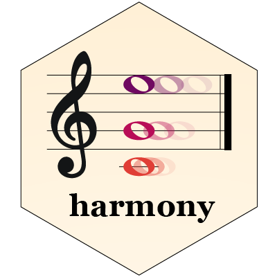

Harmony 
===========

[](https://travis-ci.org/immunogenomics/harmony)
[](https://ci.appveyor.com/project/immunogenomics/harmony)
[](https://doi.org/10.1038/s41592-019-0619-0)

*Fast, sensitive and accurate integration of single-cell data with Harmony*

Check out the manuscript in Nature Methods: 
- [nature website](https://www.nature.com/articles/s41592-019-0619-0)
- [read link](https://www.nature.com/articles/s41592-019-0619-0.epdf?shared_access_token=rDg_Rd07lrFXExt_ySj7V9RgN0jAjWel9jnR3ZoTv0NfDJkKCfDV_X9Mq3lweQmKiXEXxhrebQRjJEZdc-xNv6-7ZN1XotlD_mo5TSS4Z4eWn-kUo6mBwA5dEAKlTfR8OT6E10MZY_E-906ajbzvgg%3D%3D)

For Python users, check out the [harmonypy package](https://github.com/slowkow/harmonypy) by Kamil Slowikowski. 

# System requirements 

Harmony has been tested on R versions >= 3.4. Please consult the DESCRIPTION file for more details on required R packages. Harmony has been tested on Linux, OS X, and Windows platforms.

# Installation

To run Harmony, open R and install harmony from CRAN: 

```r
install.packages("harmony")
```

If you'd like the latest development version, install from this github directly: 

```r
library(devtools)
install_github("immunogenomics/harmony")
```

# Usage/Demos

We made it easy to run Harmony in most common R analysis pipelines. 

## Quick Start 

Check out this [vignette](https://github.com/immunogenomics/harmony/blob/master/vignettes/quickstart.Rmd) for a quick start tutorial. 

## PCA matrix

By default the harmony API will identify correct PCA embeddings. The PCA matrix needs to be precomputed. It is possible to set custom dimensional embeddings directly.

```r
library(harmony)
my_harmony_embeddings <- RunHarmony(my_pca_embeddings, meta_data, "dataset")
```


## Seurat 

You can run Harmony within your Seurat workflow with `RunHarmony()`. Prior `RunHarmony()` the PCA cell embeddings need to be precomputed through Seurat's API. For downstream analyses, use the `harmony` embeddings instead of `pca`.

For example, run Harmony and then UMAP in two lines:

```r
seuratObj <- RunHarmony(seuratObj, "dataset")
seuratObj <- RunUMAP(seuratObj, reduction = "harmony")
```

For a more detailed overview of the `RunHarmony()` Seurat interface check, the [Seurat vignette](http://htmlpreview.github.io/?https://github.com/immunogenomics/harmony/blob/master/docs/Seurat.html)

## Harmony with two or more covariates

Harmony can integrate over multiple covariates. To do this, specify a vector covariates to integrate. 

```r
my_harmony_embeddings <- HarmonyMatrix(
  my_pca_embeddings, meta_data, c("dataset", "donor", "batch_id")
)
```

Do the same with your Seurat object: 

```r
seuratObject <- RunHarmony(seuratObject, c("dataset", "donor", "batch_id"))
```

## Advanced 

The examples above all return integrated PCA embeddings. We created a more [advanced tutorial](http://htmlpreview.github.io/?https://github.com/immunogenomics/harmony/blob/master/docs/advanced.html) that explores the internal data structures used in the Harmony algorithm. 

# Reproducing results from manuscript

Code to reproduce Harmony results from the Korsunsky et al 2019 manuscript will be made available on github.com/immunogenomics/harmony2019. 


