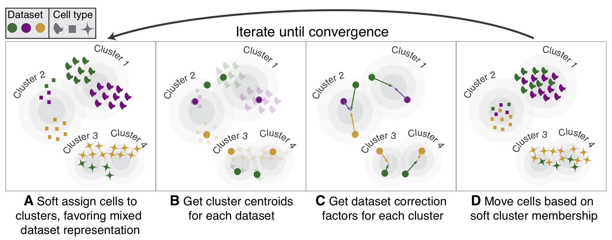

# Harmony



*Scalable integration of single cell RNAseq data for batch correction and meta analysis*

Check out the latest preprint of Harmony on [bioRxiv](https://www.biorxiv.org/content/early/2018/11/04/461954)

# Installation

To run Harmony, open R and install directly from github using the following commands: 

```
library(devtools)
install_github("immunogenomics/harmony")
```

# Getting Started

Try out Harmony on your single cell dataset! If you already have PCA embeddings for your cells and a meta data table with the variable *dataset* defined, Harmony will do the rest: 

```
library(harmony)
my_harmony_embeddings <- HarmonyMatrix(my_pca_embeddings, meta_data, "dataset")
```

Now your cell embeddings will be less dependent on your batch variable. Do you want to align the data even more? Consider increasing the alignment parameter: 

```
my_harmony_embeddings <- HarmonyMatrix(my_pca_embeddings, meta_data, "dataset", theta = 4)
```

## Harmony in a Seurat workflow

If you already have a Seurat workflow for analyzing your single cell data, check out the tutorial below. You'll only need to make two changes to your code: 

1) Run Harmony with the `RunHarmony` function
2) In downstream analyses, use the Harmony embeddings instead of PCA. For instance, in RunTSNE, specify `reduction.use = "harmony"`, or in FindClusters, specify `reduction.type = "harmony"`. 

[Aligning 10X PBMCs](https://github.com/immunogenomics/harmony/blob/master/vignettes/Seurat.ipynb)

This vignette is based on the original in [Seurat](https://satijalab.org/seurat/pbmc3k_tutorial.html)

## Harmony with two or more covariates

Harmony is able to integrate over multiple covariates. The workflow is the same as above. All you need to do is specify the covariates to integrate. 

```
my_harmony_embeddings <- HarmonyMatrix(my_pca_embeddings, meta_data, c("dataset", "donor", "batch_id"))
```

Again, if you'd like to integrate one of the variables even more, try increasing theta for that variable. Below, we leave theta=2 for *dataset* and *donor* and ratchet theta up to 4 for *batch_id*. 

```
my_harmony_embeddings <- HarmonyMatrix(my_pca_embeddings, meta_data, c("dataset", "donor", "batch_id"), theta = c(2, 2, 4))
```

You can also specify multiple covariates in your Seurat analysis pipeline: 

```
seuratObject <- RunHarmony(seuratObject, c("dataset", "donor", "batch_id"))
```


## Harmony with numerical covariates 

Harmony will soon be able to correct for read depth, cell cycle state, and other non-categorical variables. 


## Additional tutorials

- [Getting Started with Harmony (with MUDAN library)](docs/getting_started.pdf)
- Using Harmony with Seurat


