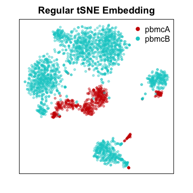
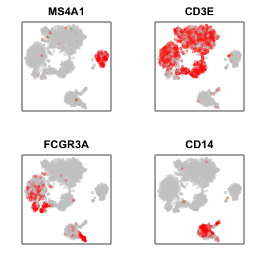
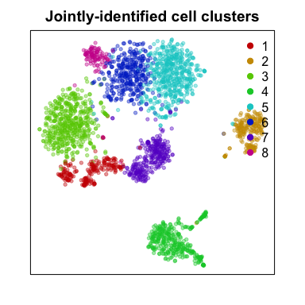
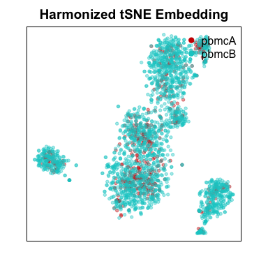
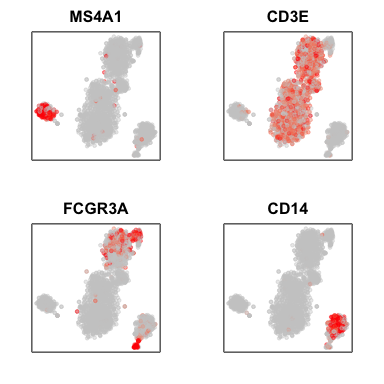
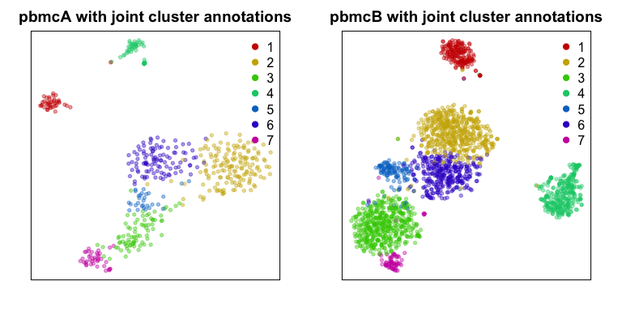

Introduction
------------

`harmony` enables scalable integration of single-cell RNA-seq data for
batch correction and meta analysis. In this tutorial, we will
demonstrate the utility of `harmony` to jointly analyze single-cell
RNA-seq PBMC datasets from two healthy individuals.

Installation
------------

First, install `harmony` if you have not already done so.

``` r
library(devtools)
install_github("immunogenomics/harmony")
```

Now we can load `harmony`

``` r
library(harmony)
```

    ## Loading required package: Rcpp

For this tutorial, we will use single-cell RNA-seq PBMC datasets that
are readily available as part of the `MUDAN` package.

``` r
install_github("JEFworks/MUDAN")
```

Now we can load the data.

``` r
library(MUDAN)
```

    ## Loading required package: Matrix

``` r
data("pbmcA")
data("pbmcB")
```

For the purposes of a quick demonstration, we will downsize the number
of cells in each PBMC dataset. To create a more challenging scenario, we
will also make one dataset much smaller than the other.

``` r
# downsample
print(dim(pbmcA))
print(dim(pbmcB))
pbmcA <- pbmcA[, 1:500] # take 500 cells
pbmcB <- pbmcB[, 1:2000] # take 2000 cells
```

    ## [1] 13939  2896
    ## [1] 15325  7765

We can now combine the two datasets into one cell by gene counts matrix
and use a `meta` vector to keep track of which cell belongs to which
sample.

``` r
# combine into one counts matrix
genes.int <- intersect(rownames(pbmcA), rownames(pbmcB))
cd <- cbind(pbmcA[genes.int,], pbmcB[genes.int,])

# meta data
meta <- c(rep('pbmcA', ncol(pbmcA)), rep('pbmcB', ncol(pbmcB)))
names(meta) <- c(colnames(pbmcA), colnames(pbmcB))
meta <- factor(meta)

print(cd[1:5,1:2])
print(meta[1:5])
```

    ## 5 x 2 sparse Matrix of class "dgCMatrix"
    ##               frozen_pbmc_donor_a_AAACATTGCACTAG
    ## AL627309.1                                     .
    ## RP11-206L10.2                                  .
    ## RP11-206L10.9                                  .
    ## LINC00115                                      .
    ## NOC2L                                          .
    ##               frozen_pbmc_donor_a_AAACATTGGCTAAC
    ## AL627309.1                                     .
    ## RP11-206L10.2                                  .
    ## RP11-206L10.9                                  .
    ## LINC00115                                      .
    ## NOC2L                                          .
    ## frozen_pbmc_donor_a_AAACATTGCACTAG frozen_pbmc_donor_a_AAACATTGGCTAAC 
    ##                              pbmcA                              pbmcA 
    ## frozen_pbmc_donor_a_AAACATTGTAACCG frozen_pbmc_donor_a_AAACCGTGTGGTCA 
    ##                              pbmcA                              pbmcA 
    ## frozen_pbmc_donor_a_AAACCGTGTTACCT 
    ##                              pbmcA 
    ## Levels: pbmcA pbmcB

Given this counts matrix, we can normalize our data, derive principal
components, and perform dimensionality reduction using tSNE. However, we
see prominent separation by sample due to batch effects.

``` r
## CPM normalization
mat <- MUDAN::normalizeCounts(cd, 
                       verbose=FALSE) 
## variance normalize, identify overdispersed genes
matnorm.info <- MUDAN::normalizeVariance(mat, 
                                  details=TRUE, 
                                  verbose=FALSE) 
## log transform
matnorm <- log10(matnorm.info$mat+1) 
## 30 PCs on overdispersed genes
pcs <- MUDAN::getPcs(matnorm[matnorm.info$ods,], 
              nGenes=length(matnorm.info$ods), 
              nPcs=30, 
              verbose=FALSE) 

# TSNE embedding with regular PCs
emb <- Rtsne::Rtsne(pcs, 
                    is_distance=FALSE, 
                    perplexity=30, 
                    num_threads=1,
                    verbose=FALSE)$Y 
rownames(emb) <- rownames(pcs)

# Plot
par(mfrow=c(1,1), mar=rep(2,4))
MUDAN::plotEmbedding(emb, groups=meta, 
                     show.legend=TRUE, xlab=NA, ylab=NA, 
                     main='Regular tSNE Embedding',
                     verbose=FALSE)
```



Indeed, when we inspect certain cell-type specific marker genes
(MS4A1/CD20 for B-cells, CD3E for T-cells, FCGR3A/CD16 for NK cells,
macrophages, and monocytes, CD14 for dendritic cells, macrophages, and
monocytes), we see that cells are separating by batch rather than by
their expected cell-types.

``` r
par(mfrow=c(2,2), mar=rep(2,4))
invisible(lapply(c('MS4A1', 'CD3E', 'FCGR3A', 'CD14'), function(g) {
  gexp <- log10(mat[g,]+1)
  plotEmbedding(emb, col=gexp, 
                xlab=NA, ylab=NA, main=g,
                verbose=FALSE)
}))
```



If we were attempt to identify cell-types using clustering analysis at
this step, we would identify a number of sample-specific clusters driven
by batch effects.

``` r
# Joint clustering
annot.bad <- getComMembership(pcs, k=30, method=igraph::cluster_louvain)
par(mfrow=c(1,1), mar=rep(2,4))
plotEmbedding(emb, groups=annot.bad, 
              show.legend=TRUE, xlab=NA, ylab=NA, 
              main='Jointly-identified cell clusters',
              verbose=FALSE)
```



``` r
# Look at cell-type proportions per sample
print(t(table(annot.bad, meta))/as.numeric(table(meta)))
```

    ## [1] "finding approximate nearest neighbors ..."
    ## [1] "calculating clustering ..."
    ## [1] "graph modularity: 0.740534386510747"
    ## [1] "identifying cluster membership ..."
    ## com
    ##   1   2   3   4   5   6   7   8 
    ## 204 229 499 352 492 338 286 100 
    ##        annot.bad
    ## meta         1      2      3      4      5      6      7      8
    ##   pbmcA 0.2860 0.0860 0.0040 0.0880 0.0000 0.0000 0.5360 0.0000
    ##   pbmcB 0.0305 0.0930 0.2485 0.1540 0.2460 0.1690 0.0090 0.0500

In order to better identify cell-types that may be common to both
samples, we will use `harmony` to integrate the cells into a unified
embedding.

``` r
# Now harmonize PCs
harmonized <- HarmonyMatrix(pcs, meta)
```

    ## Harmony 1/10

    ## Harmony 2/10

    ## Harmony 3/10

    ## Harmony 4/10

    ## Harmony 5/10

    ## Harmony 6/10

    ## Clustered for 73 iterations
    ## Clustered for 26 iterations
    ## Clustered for 51 iterations
    ## Clustered for 30 iterations
    ## Clustered for 31 iterations
    ## Clustered for 29 iterations
    ## Harmony converged after 6 iterations

Now, the two samples are well mixed.

``` r
# TSNE embedding with harmonized PCs
emb.harmony <- Rtsne::Rtsne(harmonized, 
                    is_distance=FALSE, 
                    perplexity=30, 
                    num_threads=1,
                    verbose=FALSE)$Y 
rownames(emb.harmony) <- rownames(harmonized)

# Plot
par(mfrow=c(1,1), mar=rep(2,4))
MUDAN::plotEmbedding(emb.harmony, groups=meta, 
              show.legend=TRUE, xlab=NA, ylab=NA, 
              main='Harmonized tSNE Embedding',
              verbose=FALSE)
```



Indeed, when we inspect the same cell-type specific markers as we did
previously, we now see that cells are clustered by putative cell-type
rather than separating by batch.

``` r
par(mfrow=c(2,2), mar=rep(2,4))
invisible(lapply(c('MS4A1', 'CD3E', 'FCGR3A', 'CD14'), function(g) {
  gexp <- mat[g,]
  plotEmbedding(emb.harmony, col=gexp, 
                xlab=NA, ylab=NA, main=g,
                verbose=FALSE)
}))
```



Now, we can jointly identify cell-type clusters. In this case, the
cell-types are comparably represented in proportion across the two
samples.

``` r
# Joint clustering
com <- getComMembership(harmonized, k=30, method=igraph::cluster_louvain)
par(mfrow=c(1,1), mar=rep(2,4))
plotEmbedding(emb.harmony, groups=com, 
              show.legend=TRUE, xlab=NA, ylab=NA, 
              main='Jointly-identified cell clusters',
              verbose=FALSE)
```


``` r
# Look at cell-type proportions per sample
print(t(table(com, meta))/as.numeric(table(meta)))
```

    ## [1] "finding approximate nearest neighbors ..."
    ## [1] "calculating clustering ..."
    ## [1] "graph modularity: 0.701302386894473"
    ## [1] "identifying cluster membership ..."
    ## com
    ##   1   2   3   4   5   6   7 
    ## 227 671 560 353 145 434 110 
    ##        com
    ## meta         1      2      3      4      5      6      7
    ##   pbmcA 0.0840 0.3240 0.1580 0.0900 0.0580 0.2060 0.0800
    ##   pbmcB 0.0925 0.2545 0.2405 0.1540 0.0580 0.1655 0.0350

We can also analyze each sample separately and see how our
jointly-dervied cell-type clusters map onto each individual sample’s
embeddings.

``` r
# Assess validity of joint-derived clusters in individual samples
emb1 <- Rtsne::Rtsne(pcs[meta=='pbmcA',], 
                    is_distance=FALSE, 
                    perplexity=30, 
                    num_threads=1,
                    verbose=FALSE)$Y 
rownames(emb1) <- rownames(pcs)[meta=='pbmcA']
emb2 <- Rtsne::Rtsne(pcs[meta=='pbmcB',], 
                     is_distance=FALSE, 
                     perplexity=30, 
                     num_threads=1,
                     verbose=FALSE)$Y 
rownames(emb2) <- rownames(pcs)[meta=='pbmcB']

# Plot
par(mfrow=c(1,2), mar=rep(2,4))
MUDAN::plotEmbedding(emb1, groups=com, 
                     show.legend=TRUE, xlab=NA, ylab=NA, 
                     main='pbmcA with joint cluster annotations',
                     verbose=FALSE)
MUDAN::plotEmbedding(emb2, groups=com, 
                     show.legend=TRUE, xlab=NA, ylab=NA, 
                     main='pbmcB with joint cluster annotations',
                     verbose=FALSE)
```


